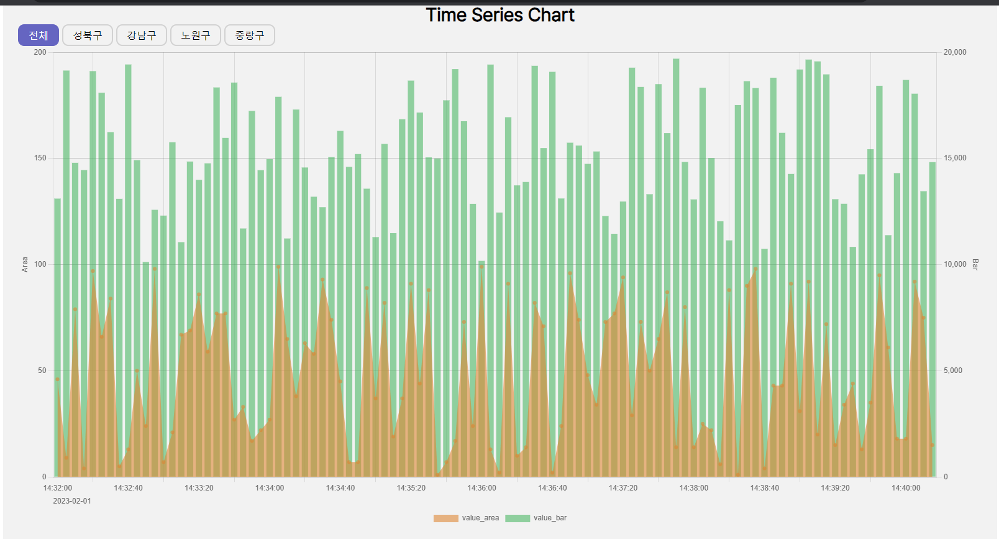

# 지역 데이터 복합 그래프 구현 프로젝트

db.json에 있는 데이터를 복합 그래프로 나타내는 프로젝트입니다.

# 목차

- [time-series-chart](#time-series-chart)
- [목차](#목차)
  - [🔗 배포 링크](#-배포-링크)
  - [⚙️ 실행 방법](#️-실행-방법)
  - [⌛ 진행 과정](#-진행-과정)
    - [회의 및 기록](#회의-및-기록)
  - [📂 폴더 구조](#-폴더-구조)
  - [🛠️ 기술 스택](#️-기술-스택)

## ⚙️ 실행 방법

#### 로컬실행

```
git clone https://github.com/ChoByungHyun/time-series-chart.git
echo "REACT_APP_SERVER_URL = \"https://ink-ambitious-spirit.glitch.me\"" > .env
npm install
npm run start
```

## 🔗 배포 링크

배포 URL - [time-series-chart-eight.vercel.app](http://time-series-chart-eight.vercel.app)

## 🖼️ 실행 화면



## 📂 폴더 구조

```
project-root/
│
├── public/ # 정적 파일들
│ ├── index.html
│ └── manifest.json
│
├── src/ # 소스 코드
│ ├── components/    # 재사용 컴포넌트들
│ ├── api/           # api 함수들
│ ├── pages/         # 페이지별 컴포넌트
│ ├── router/        # 라우팅
│ ├── App.tsx        # App 컴포넌트
│ ├── index.tsx      # 진입점 파일
│ └── GlobalStyle.ts # 전역 스타일 설정파일
│
├── .env
├── .gitignore
├── .prettierrc.js
├── .eslintrc
├── package.json
├── tsconfig.json
└── README.md


```

## 🛠️ 기술 스택

 
 
 

